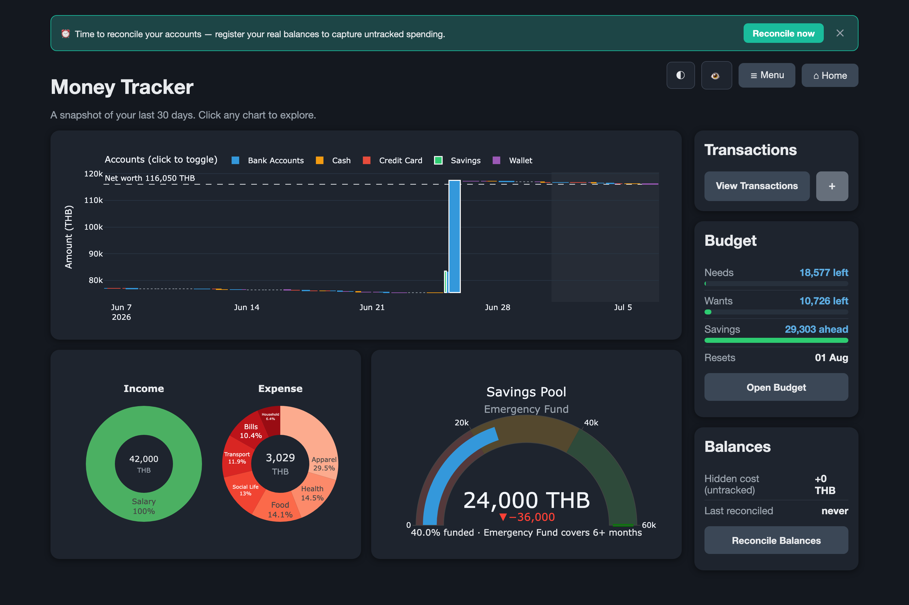
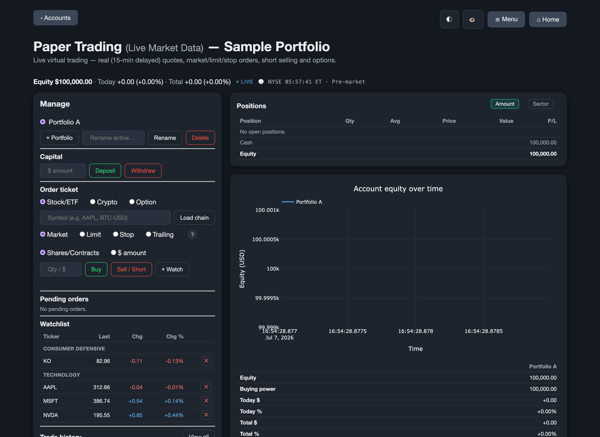
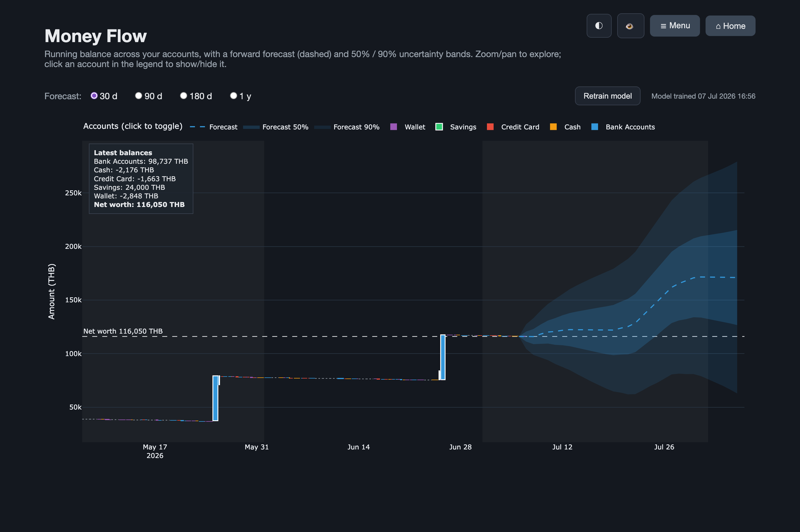
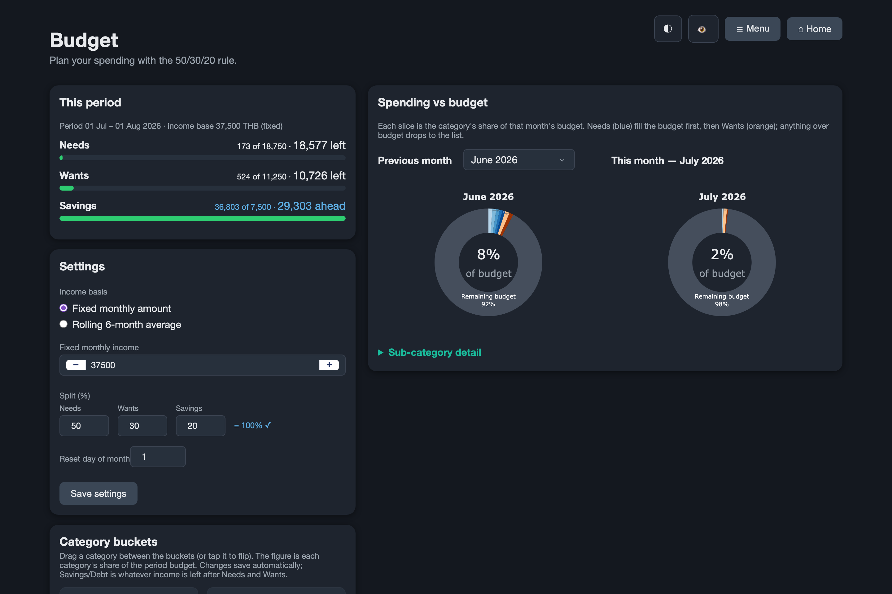

# Money Tracker

A single-user, local, file-backed **personal-finance + investing suite** with a web UI.
It combines day-to-day money tracking (transactions, budgets, goals, reconciliation) with
market tooling (a historical investment simulator, an intrinsic-value calculator, and a live
paper-trading desk) — all running on your own machine with **no accounts, no API keys, and no
cloud**. Your data lives in local files under `data/` and `config/`: a single-file **SQLite**
ledger (`data/raw/ledger.db`) plus plain `.json` / `.toml` configuration.

- **Stack:** Python · [Dash](https://dash.plotly.com/) (multi-page) · Plotly · pandas · numpy · statsmodels
- **Market data:** [yfinance](https://github.com/ranaroussi/yfinance) (≈15-min-delayed quotes, keyless)
- **Storage:** local files only — a zero-setup SQLite file (Python stdlib), no database server
- **Runs at:** <http://127.0.0.1:8050>

> **Disclaimer.** This is a personal-finance tool for tracking and learning. Nothing here is
> financial advice. Paper trading is a **simulation** using delayed public quotes — no real
> orders are ever placed.

## Download & run (no Python needed)

Prefer a double-click? Grab a ready-made build for your OS from the
[**Releases**](https://github.com/SKoonkor/WhereDidMyMoneyGo/releases) page — **no Python, no
terminal**. It opens in your browser and keeps running behind a small **tray / menu-bar icon**
(*Open Money Tracker* / *Quit*); closing the browser tab leaves it running in the tray.

| OS | Download | First launch |
|---|---|---|
| **macOS** | `MoneyTracker-macOS.dmg` | Open the DMG, drag **Money Tracker** into **Applications**. First open: right-click the app → **Open** → **Open** (unsigned build, so macOS asks once). |
| **Windows** | `MoneyTracker-Windows.exe` | Double-click. SmartScreen may warn — click **More info → Run anyway** (unsigned build). |
| **Linux** | `MoneyTracker-Linux.AppImage` | `chmod +x MoneyTracker-Linux.AppImage`, then double-click or run it. |

> 📖 **New to this? Follow the step-by-step [Download & run guide](docs/download-and-run.md)** —
> per-OS walkthroughs, where your data is stored, updating, and troubleshooting.

The app serves at <http://127.0.0.1:8050> (it picks another free port automatically if 8050 is
busy — use the tray's **Open Money Tracker** to get the right link). Your data lives in a per-user
folder: macOS `~/Library/Application Support/MoneyTracker`, Windows `%APPDATA%\MoneyTracker`,
Linux `~/.local/share/money-tracker`. Builds are currently **unsigned** (signing/notarization is
planned), so each OS shows a one-time "unidentified developer" prompt — the steps above (and the
guide) clear it. Developers can still run from source below.

## Screenshots

<!-- Captured with synthetic sample data in an isolated sandbox — never a real ledger. -->

**Home dashboard** — 30-day money flow, income/expense pies, savings gauge, and budget summary.


**Paper Trading desk** — order ticket, live positions, an equity curve, and a watchlist on real delayed quotes.


**Money Flow** — running balance across accounts with a forward forecast and uncertainty bands.


**Budget** — a 50/30/20 model with spending-vs-budget for the current and previous month.


## Features

### Personal-finance core
- **Home dashboard** — 30-day snapshots of money flow, category pies, and a savings gauge; click a chart to open its page.
- **Money Flow** — running-balance waterfall; toggle accounts and pick date ranges.
- **Income / Expense** — category pies over 30 / 120 / 365 days or a custom period.
- **Financial Goals** — a savings-pool gauge; goals stack on top of your emergency fund.
- **Budget** — a Needs / Wants / Savings budget model with tracking against your spending.
- **Transactions** — a monthly ledger: add / edit / delete income, expenses (category › subcategory), and transfers. Automatic timestamped backups.
- **Reconcile Balances** — reconcile tracked account balances against the computed figures and surface hidden cost.
- **Compound Interest** — a standalone growth calculator with a ±20% rate band.

### Investing / markets
- **Investment Simulator** — a historical backtesting "game": buy/sell stocks at a chosen game date.
- **Stock Intrinsic Valuation** — DCF & multiples models (formulas documented in [`docs/intrinsic_value_formulas.md`](docs/intrinsic_value_formulas.md)).
- **Paper Trading** — the most developed module: live virtual trading on real delayed quotes, with multiple accounts (up to 3 portfolios each), market / limit / stop / trailing orders, short selling, options, a watchlist with fundamentals, sector comparison, and rich price+volume charts.

### Cross-cutting
- **Dark / light theme** toggle (remembered by your browser) — starts in dark mode; use the ◐ button, top-right of every page.
- **Privacy "censor" toggle** (👁) that masks exact money amounts across all figures — handy for screenshots or screen-sharing.
- **Disk caches** for market data with TTLs, under `data/stocks_cache/`.

## Requirements

- **Python 3.9 or newer** (developed and tested on 3.14). On 3.9/3.10 the TOML reader
  `tomli` is installed automatically (it is stdlib `tomllib` from 3.11 on).
  Note that Python 3.9 reached end-of-life in October 2025, so a newer version is
  still recommended where you can install one.
- The packages in [`requirements.txt`](requirements.txt): pandas, openpyxl, numpy, plotly, dash, statsmodels, yfinance.

> **Don't have a recent Python?** You don't need to change your system Python — grab one just for this app:
> - [`uv`](https://docs.astral.sh/uv/): `uv run --python 3.12 run_app.py` (downloads the interpreter on demand).
> - [`pyenv`](https://github.com/pyenv/pyenv): `pyenv install 3.12 && pyenv local 3.12`, then follow the steps below.

## Install & run

```bash
# from the project root
python -m venv .venv && source .venv/bin/activate   # Windows: .venv\Scripts\activate
pip install -r requirements.txt
python run_app.py
```

Then open <http://127.0.0.1:8050>.

On **first run** the app bootstraps itself: it creates the `data/` directories and, if you don't
have a `config/` yet, seeds one from the shipped [`config.example/`](config.example/) templates.
It starts with **no transactions** — add your first one from the **Transactions** page.

**Coming from Realbyte Money Manager** (or an older version of this app)? Place your exported
`transactions.xlsx` at `data/raw/transactions.xlsx` before launching. If no `ledger.db` exists
yet, the app converts it automatically on start-up and archives the original to
`data/backups/transactions_legacy_<timestamp>.xlsx`. (To re-import later, remove `ledger.db`
first — an existing ledger is never overwritten.)

### Configuration via environment variables

| Variable | Default | Meaning |
|---|---|---|
| `MT_PORT` | `8050` | Port to serve on |
| `MT_HOST` | `127.0.0.1` | Interface to bind (localhost only by default) |
| `MT_DEBUG` | *(off)* | Set to `1`/`true` to enable Dash debug mode |
| `MT_DATA_DIR` | *(see below)* | Override the config/data folder. Defaults to the project root from source, and the per-user app-data folder in the packaged build. |

```bash
MT_PORT=9000 python run_app.py
```

> The bundled server is Flask's development server. It's fine for local single-user use; if you
> ever expose it, put it behind a proper WSGI server and keep `MT_DEBUG` off.

### Building the desktop apps yourself

The downloadable builds are produced by [`.github/workflows/build.yml`](.github/workflows/build.yml)
(PyInstaller, one job per OS). To build locally for your current platform:

```bash
pip install -r requirements.txt -r requirements-build.txt
pyinstaller packaging/moneytracker.spec       # output under dist/
```

The desktop entry point is [`desktop.py`](desktop.py); regenerate the icon with
`python packaging/make_icon.py`.

## Pages

| Page | Path | What it does |
|---|---|---|
| Home | `/` | 30-day snapshots; click a chart to open its page |
| Money Flow | `/flow` | Running-balance waterfall; account toggles + date ranges |
| Income / Expense | `/pie` | Category pies over 30 / 120 / 365 days or custom |
| Financial Goals | `/goals` | Savings-pool gauge; goals stack on the emergency fund |
| Compound Interest | `/compound` | Growth calculator with a ±20% band |
| Budget | `/budget` | Needs / Wants / Savings budget model & tracking |
| Transactions | `/transactions` (+ `/transactions/add`, `/transactions/edit/<id>`) | Monthly ledger: add / edit / delete income, expense, transfers |
| Reconcile Balances | `/reconcile` | Reconcile tracked vs. computed balances |
| Investment Simulator | `/invest` | Historical backtesting game |
| Stock Intrinsic Valuation | `/valuation` | DCF & multiples valuation |
| Paper Trading | `/paper` (accounts) → `/paper/trade` | Live virtual trading on delayed quotes |

## Your data & configuration

Everything personal lives under `config/` and `data/` — **both are git-ignored**, so your real
finances never get committed.

**`config/`** (seeded from `config.example/` on first run):

| File | Purpose |
|---|---|
| `settings.toml` | App name, **base currency** (stamped on new transactions and used as the display currency), data dir, emergency-fund target, date formats |
| `accounts.json` | Account names (also managed from the account picker) |
| `transaction_categories.json` | Income/expense category → subcategory tree |
| `goals.json` · `budget.json` · `forecast.json` · `reconciliation.json` | Created on demand by the relevant page |
| `investment_game.json` · `investment_stocks.json` · `paper_accounts/` | Created by the simulator / valuation / paper-trading features |

**`data/`**

```
data/
├── raw/           ← ledger.db (the single source of truth — SQLite)
├── backups/       ← automatic timestamped backups (ledger_*.db, 20 most recent kept)
│                     + any archived legacy transactions_*.xlsx (kept forever)
├── stocks_cache/  ← cached market data (regenerable)
└── processed/     ← reserved
```

Every transaction row carries a permanent unique id, its date, type (`Income`, `Expense`,
`Transfer-In/Out`, or reconciliation `Adjustment-In/Out`), account, category › subcategory,
amount, and currency. Transfer pairs are linked by a shared id.

### Recording transactions
The **Transactions** page edits the SQLite ledger:
- **Add** — Income, Expense (category › subcategory), or Transfer between two accounts. **Save** returns to the list; **Continue** keeps the form open for batch entry.
- **Edit / Delete** — click any row; deleting a transfer removes both linked rows.
- **Safety** — a timestamped backup of the ledger is written to `data/backups/` before every change.

### Backup &amp; Restore
The **Backup &amp; Restore** page (`/backup`, also in the Menu) covers all of it:
- **⬇ Download backup** — one zip of `config/` (settings, accounts, categories, goals,
  budget, paper-trading accounts, import profiles) and `data/raw/` (the ledger). That's
  your complete personal state; market caches are excluded (they rebuild).
- **Restore from a backup file** — upload a backup zip; it's validated and summarised
  first, and restoring saves a snapshot of the *current* state to `data/backups/` before
  anything is replaced.
- **Automatic backups** — a browser for the per-write ledger snapshots (20 kept), with
  one-click restore for any of them.

### Importing data
The **⬆ Import** button (or `/import`) opens a wizard that brings transactions in from
another app or a bank export (`.csv` / `.xlsx`):

1. **Upload** — encoding and delimiter are sniffed automatically; known layouts
   (**Money Tracker export**, **Realbyte Money Manager**, **YNAB register**, and any
   profile you've saved) are detected from the headers.
2. **Map columns** — tell it which column is the Date, Amount (a signed amount, a
   Type column, or bank-style Inflow/Outflow pairs), Account, Category, and so on.
   Day-first dates and European decimals (`1.234,56`) are supported.
3. **Review** — a preview shows what will be imported, rows skipped (with reasons),
   unknown accounts (create them or map them onto existing ones — categories are
   created automatically), and **possible duplicates** (same day, amount, account,
   and type as an existing entry) which are skipped unless you tick them. Rows from a
   re-imported Money Tracker export are recognised by their ids and never duplicated.
4. **Import** — a backup is taken first, and **Undo** restores the ledger to the
   moment before the import.

Save your column mapping as a **profile** and the wizard will recognise that file
layout automatically next time. Profiles live in `config/import_profiles/`.

### Exporting your data
The **⬇ Export** button on the Transactions page downloads your ledger as **CSV** or
**Excel** — either the month you're viewing or everything. Columns:

```
Id, Date, Type, Account, Category, Subcategory, Amount, Currency, Note, Description, TransferId
```

`Date` is `YYYY-MM-DD HH:MM:SS`; `Type` is `Income`, `Expense`, `Transfer-In/Out`, or a
reconciliation `Adjustment-In/Out`. For transfers, `Category` holds the counter-account and the
two halves share a `TransferId`. CSV is UTF-8 (with BOM, so Excel renders non-Latin text
correctly). The export mirrors the ledger one-to-one, so it doubles as a plain-text backup.

## Project structure

```
money_tracker/
├── run_app.py          ← web app entry point (bootstraps data/ + config/ on first run)
├── config.example/     ← shipped config templates (copied to config/ on first run)
├── docs/               ← documentation (valuation formulas, images)
├── data/               ← your ledger, backups, caches (git-ignored)
├── config/             ← your settings (git-ignored)
├── requirements.txt
└── src/
    ├── io/             ← store.py (SQLite ledger) & migrate.py (legacy xlsx import), quotes/fundamentals/stocks
    ├── processing/     ← balances & date filtering
    ├── analytics/      ← accounts, goals, budget, forecast, reconciliation, valuation, paper engine
    ├── utils/          ← config loading & first-run bootstrap
    └── app/            ← Dash app (pages/, figures/, assets/, data layer, theme)
```

## Market data

Quotes and fundamentals come from **yfinance**, which scrapes public Yahoo Finance data. It's
keyless and free but **unofficial** — it can rate-limit or break without notice. Quotes are
delayed (~15 min) and cached briefly on disk. Treat all market features as informational.

## License

Released under the [MIT License](LICENSE).
